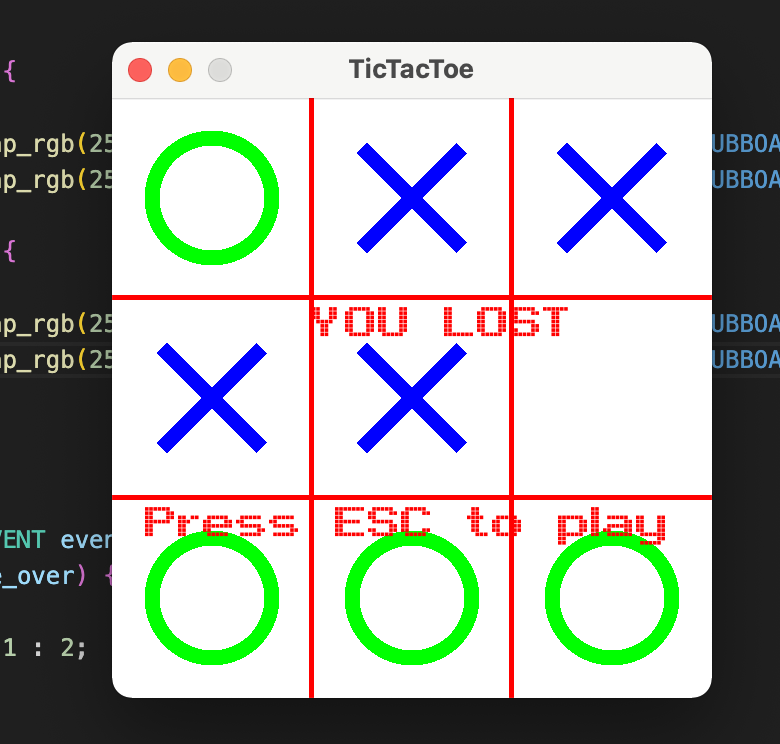

# Übung 4 - Lösung

## 1.Allegro 5 Projekt (src/game)

### Lösungsidee
TicTacToe.
Zuerst werden allegro, keyboard, font, mouse installiert und  event queue angelegt. Wenn game startet und player click macht, dann wird koordinate genommen. Function find_index gibt index von Array wo alle Einträge gespeichert werden. Dann wird mit Function is_valid geprüft ob diese index valid oder nicht. Wenn ja, dann wird mit Function markBoard in diesem index 'X' oder 'o' gespeichert und wert von player erhöht. Wenn diese index nicht valid ist, dann gibt user (oder computer - random number) neue index - macht neue click. 
Function check_for_win prüft wer als Erster drei Zeichen in eine Zeile, Spalte oder Diagonale setzt. Wenn player 1 gewinnt, dann wird text "You won" ausgegeben. Wenn player 2 gewinnt, dann wird text "You lost" ausgegeben. Dann kann mit "Escape" button game neue starten werden. Am Ende wird queue events unregistered und entfernt(destroy).

### Implementierung
siehe code

### Tests

